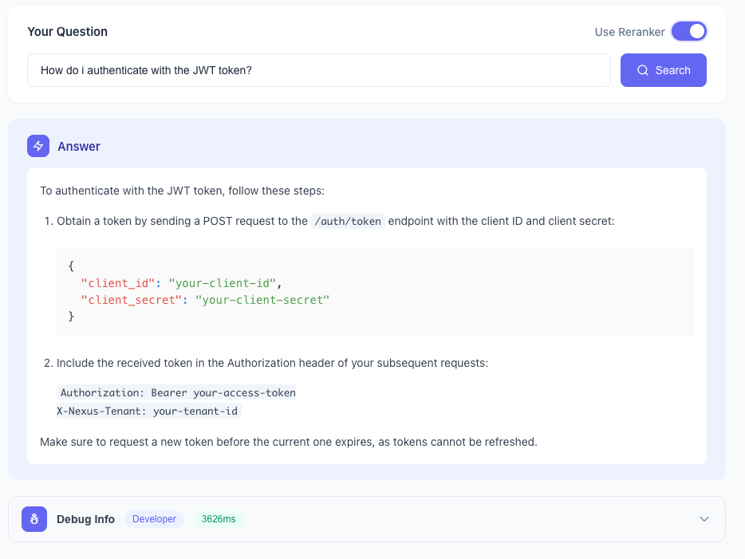
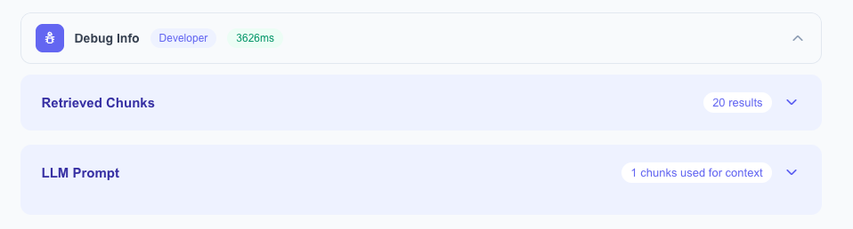
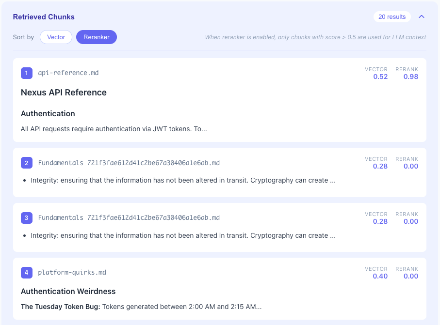

# RAG Learning Project

A simplified Retrieval Augmented Generation (RAG) system built to understand how the core components work together.

## What It Does

Upload markdown documents, then ask questions in natural language. The system retrieves relevant chunks from your documents and generates answers grounded in that content.



## Features

- **Document upload** — Upload `.md` files which are automatically chunked, embedded, and indexed
- **Natural language search** — Ask questions like "What's the refund policy?" instead of keyword matching
- **Vector similarity search** — Finds semantically relevant content even without exact word matches
- **Reranker toggle** — Compare results with and without Cohere reranking to see how it affects retrieval quality
- **Debug view** — Inspect retrieved chunks, similarity scores, reranker scores, and the full prompt sent to the LLM

## Debug View

The debug panel lets you see exactly what's happening under the hood:



Expand "Retrieved Chunks" to see how each chunk was scored:



Each chunk shows both **Vector** and **Rerank** scores side-by-side. This lets you compare how the two ranking methods differ:
- **Vector score**: Cosine similarity between query embedding and chunk embedding (fast, but purely geometric)
- **Rerank score**: Cohere's cross-encoder relevance score (slower, but understands the actual question-answer relationship)

You can sort by either score to see how rankings change. Notice how a chunk might rank high by vector similarity but low by reranker (or vice versa) — this illustrates why two-stage retrieval improves quality.

## Reranker Trade-offs

| Reranker | Speed | Quality | Best For |
|----------|-------|---------|----------|
| **Off** | ~200ms faster | Vector similarity only | Straightforward queries, lower latency requirements |
| **On** | Additional API call | More accurate retrieval | Ambiguous queries where multiple chunks seem similar but only some answer the question |

## Purpose

This project ties together the key components of a RAG system:

- **Embeddings** — Converting text to vectors using OpenAI's embedding API
- **Vector Search** — Storing and querying vectors with pgvector (PostgreSQL extension)
- **Chunking** — Splitting documents into searchable pieces
- **Reranking** — Using Cohere's rerank API to improve retrieval quality
- **LLM Integration** — Generating answers from retrieved context using GPT-4o-mini

**This is a learning exercise, not production code. Chunking is intentionally basic. The goal was to understand the end-to-end flow, not optimize individual components.**

## Architecture Overview

```
┌─────────────────────────────────────────────────────────────────┐
│                         Frontend (React)                        │
│                    Search UI with debug info                    │
└─────────────────────────────────────────────────────────────────┘
                                 │
                                 ▼
┌─────────────────────────────────────────────────────────────────┐
│                        Backend (Express)                        │
│                                                                 │
│  ┌─────────────┐    ┌─────────────┐    ┌─────────────────────┐ │
│  │   Upload    │    │   Search    │    │   Chunker Worker    │ │
│  │  Controller │    │  Controller │    │   (pg-boss queue)   │ │
│  └─────────────┘    └─────────────┘    └─────────────────────┘ │
│         │                  │                     │              │
│         ▼                  ▼                     ▼              │
│  ┌─────────────────────────────────────────────────────────────┐│
│  │                      Services Layer                         ││
│  │  ┌──────────────┐  ┌──────────────┐  ┌──────────────────┐  ││
│  │  │UploadService │  │SearchService │  │  ChunkerService  │  ││
│  │  └──────────────┘  └──────────────┘  └──────────────────┘  ││
│  └─────────────────────────────────────────────────────────────┘│
│                              │                                  │
│         ┌────────────────────┼────────────────────┐            │
│         ▼                    ▼                    ▼            │
│  ┌─────────────┐      ┌─────────────┐      ┌─────────────┐    │
│  │   OpenAI    │      │   Cohere    │      │  pgvector   │    │
│  │ (embeddings │      │ (reranker)  │      │ (PostgreSQL)│    │
│  │  + chat)    │      │             │      │             │    │
│  └─────────────┘      └─────────────┘      └─────────────┘    │
└─────────────────────────────────────────────────────────────────┘
```

## The RAG Flow

1. **Upload**: Documents are uploaded → chunked → embedded → stored in pgvector
2. **Search**: User query is embedded → vector similarity search finds candidates
3. **Rerank** (optional): Cohere reranker scores chunks by relevance to the question
4. **Generate**: Top chunks + query sent to LLM → answer generated

## Additional Tools

- **pg-boss** — PostgreSQL-based job queue for async document processing. Alternative to SQS/RabbitMQ that keeps everything in Postgres.
- **Inversify** — Dependency injection container. Built without NestJS to maintain explicit control over DI and adhere to SOLID principles.

## Tech Stack

| Component | Technology |
|-----------|------------|
| Backend | Express + TypeScript |
| Frontend | React |
| Database | PostgreSQL + pgvector |
| Embeddings | OpenAI text-embedding-3-small |
| Reranker | Cohere rerank-english-v3.0 |
| LLM | GPT-4o-mini |
| Job Queue | pg-boss |
| DI | Inversify |

## Setup

See [SETUP.md](SETUP.md) for installation instructions and required environment variables.
